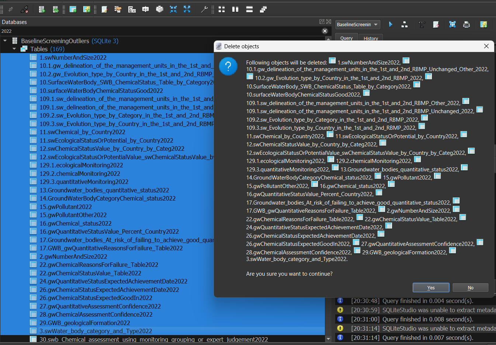

Csv to Sql Database for Outliers
=
Prerequest
-
- Csv
```
pip install python-csv
```
- Need to create only a sqlite database (not headers, data and data type) by following this tutorial:
  https://www.guru99.com/sqlite-database.html#2
- The data of baseline need to added once.
- To run the Outliers for other country you need to delete the tables how ending at `2022` at database and run over the script.<br>
  I personaly use sqlite studio and type 2022 at search, top left, and delete the tables how ends with `2022`<br>
  
  
  
Execution instructions:
=

For main.py:<br>
- Import sqlite3, csv, glob and os libraries.
- Change the path of database: `conn = sqlite3.connect('C:/path/to/database/nameOfDatabase.sqlite')`<br>
- Change the path of csv files: `do_directory('C:/path/to/extracted/csv/files/', conn)`

Input data:
-
- Use the extracted data from Baseline and Screening scripts.
